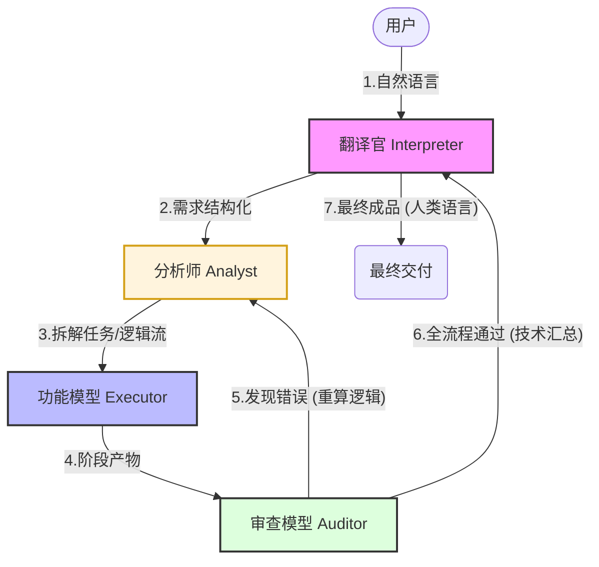

# AI-IronTriangle-Concept

> **一种基于“职能彻底解耦”的 AI 生产流水线构想**

## 1. 构思初衷
目前的 AI 总是试图在一个模型里完成所有事：理解人话、写代码、分析逻辑、自检。这导致模型非常臃肿，且在个人用户的 8GB 显存（如我的 RTX 5060）等本地设备上效率极低。我一直在想，能不能像社会分工一样，把 AI 的职能彻底拆开？

## 2. 架构设计（核心流程）
我推演了一个四层级联的逻辑链条，将“思考”与“执行”完全物理隔离：

* **翻译官模型 (Interpreter)**：
    * **入向**：负责语义降噪。把充满歧义的人类语言翻译成 AI 易读的结构化需求。
    * **出向**：负责将审查后的最终产物“翻译”回人类语言，提供结案说明。
* **分析师模型 (Analyst)**：**系统的中枢神经**。负责将翻译官传达的大型需求拆解为一个个可执行的“微型任务流”。它不写代码，只制定逻辑步骤，确保执行不会跑偏。
* **功能性模型 (Executor)**：只负责核心执行。接收分析师的细分指令，输出纯粹的功能产物（如 Java 代码）。
* **审查模型 (Audit)**：负责闭环质检。它同步接入分析师的逻辑链，校验功能模型的产出。
    * **循环**：若发现 Bug，反向驱动分析师重新规划或驱动执行者重写。
    * **完结**：审查通过后，将产物回传给翻译官。

## 3. 核心流程图 (Workflow)

## 4. 这种设计的优势

* **硬件友好**：通过职能拆分，可以用四个小型专业模型替代一个超大模型，极大压榨本地显卡性能（如我的 RTX 5060）。
* **逻辑 防抖**：通过“分析师”层的二次拆解，执行层只处理微量任务，有效避免长上下文导致的逻辑断裂和“幻觉”。
* **机器语协作**：未来模型间可直接传递隐空间向量，跳过文字转换，通讯效率将实现指数级提升。
* **按需裁剪 (Role-Specific Pruning)**：由于职能完全解耦，我们可以针对每个角色进行“知识阉割”。例如执行者只需掌握 Java 知识，无需冗余的通用知识。这使得在有限的显存下，每个节点都能发挥出超越其体积的专业性能。
---

关于作者：一名软件技术专业在读学生。这是我的一些直觉推演，目前正处于构思阶段，也利用了 AI 帮我整理思路，欢迎各位大佬指教、探讨。
